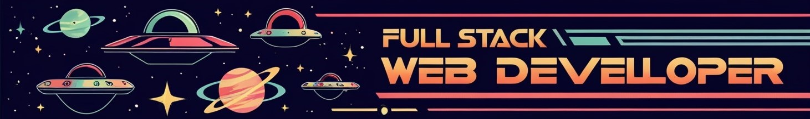

# Hola, soy Oscar 👋

Soy un desarrollador web apasionado por la tecnología y en constante aprendizaje. Me especializo en el desarrollo web front-end, haciendo uso de diferentes tecnologías para crear sitios web dinámicos y responsivos que brinden una gran experiencia de usuario. 

## Habilidades 🚀
- HTML5, CSS3, JavaScript 🌐
- ReactJS ⚛️
- Bootstrap, Tailwind CSS 🎨
- Git, GitHub 🐙
- Diseño responsive 📱
- UX/UI design 🎨💡
- MySQL 💾
- PHP 🐘

## Tecnologías que estoy aprendiendo 🌱

- MongoDB
- Express
- AngularJS
- VueJS

## Herramientas

Aquí hay algunas de las herramientas que suelo utilizar:

- Visual Studio Code 💻
- Sublime Text 📝

## Contacto 📫
- [LinkedIn](https://www.linkedin.com/in/oscar-laro/)
- ryuucoder@gmail.com
